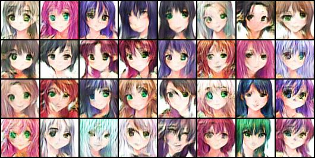

# simpleGAN

>A simple PyTorch Implementation of GANs for anime face drawing.

### Usage

1. Train

You can run the GANs by following the format of the script [work.sh](work.sh). You can mmodify the hyper-parameters for obtaining better performance.

   ```bash
	echo wait a minitus
   ```

2. Generate

After training, you can generate the fake anime face images by runing the script generate.sh.

   ```bash
	echo nimazhale
   ```
### Result

#### Original Images

#### Fake Images for Epoch 1


#### Fake Images for Epoch 5


#### Fake Images for Epoch 10



#### Fake Images for Epoch 20


#### Fake Images for Epoch 30


### How to get the dataset?